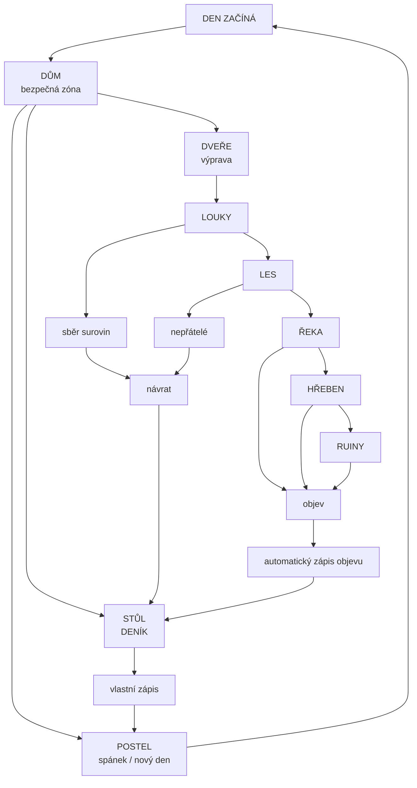
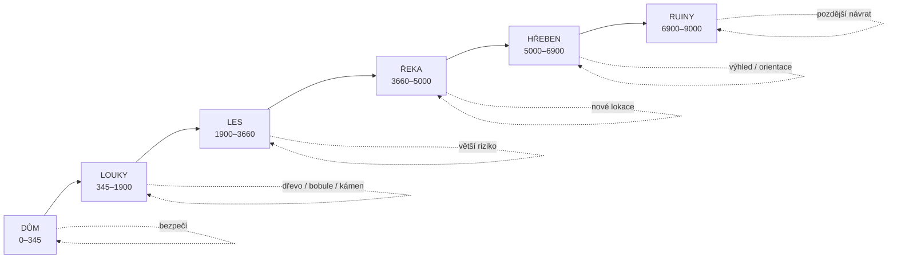
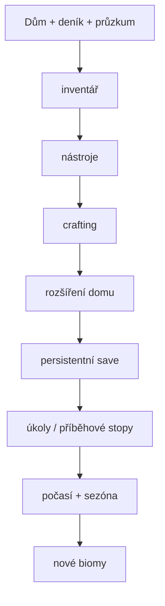

# WILDLANDS — herní plán

## Hlavní smyčka

## Svět

## Deník

Deník je persistentní herní prvek uložený v localStorage.

- vlastní zápisy hráče
- automatické zápisy významných objevů
- historie posledních zápisů
- zápisy jsou vázané na herní den
- stav zůstává po obnovení stránky

## Další fáze

Priorita je zachovat jednoduchou smyčku: **dům → výprava → objev → deník → návrat → spánek**. Další systémy se mají přidávat kolem ní, ne ji nahrazovat.

## Stav implementace

- [x] Dům jako bezpečný hub
- [x] Muž jako protagonista
- [x] Průzkum horizontálního světa
- [x] Oblasti a landmarks
- [x] Den/noc
- [x] Sběr surovin
- [x] Deník s vlastními zápisy
- [x] Automatické zápisy objevů
- [x] Persistentní save pozice, zdrojů a objevů
- [ ] Inventář UI
- [ ] Nástroje
- [ ] Crafting
- [ ] Interiér domu jako skutečná samostatná lokace
- [ ] Rozšíření domu
- [ ] Příběhové stopy
- [ ] Počasí
- [ ] Více biomů a procedurálních událostí
- [ ] Save sloty

## Designové pravidlo

Dům nemá být jen spawn point. Je to místo, kam se hráč vrací, aby **zpracoval zkušenost z výpravy**: přečetl deník, doplnil zásoby, odpočinul si a rozhodl se, kam půjde další den.
