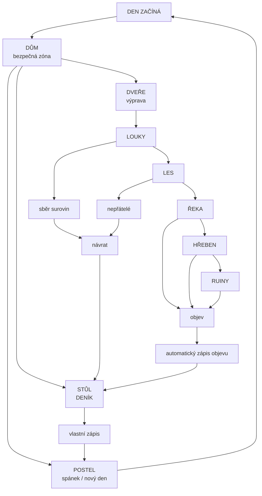
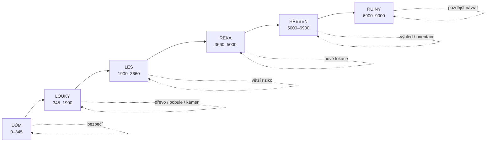
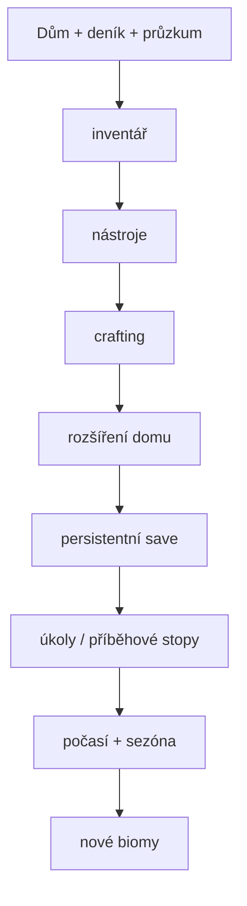
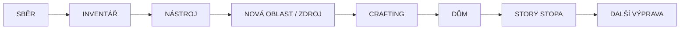
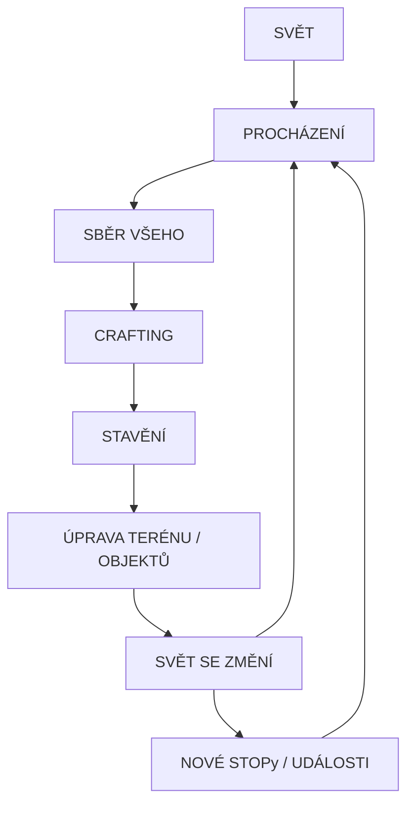

# WILDLANDS — herní plán

## Hlavní smyčka

## Svět

## Deník

Deník je persistentní herní prvek uložený v localStorage.

- vlastní zápisy hráče
- automatické zápisy významných objevů
- historie posledních zápisů
- zápisy jsou vázané na herní den
- stav zůstává po obnovení stránky

## Další fáze

Priorita je zachovat jednoduchou smyčku: **dům → výprava → objev → deník → návrat → spánek**. Další systémy se mají přidávat kolem ní, ne ji nahrazovat.

## Stav implementace

- [x] Dům jako bezpečný hub
- [x] Muž jako protagonista
- [x] Průzkum horizontálního světa
- [x] Oblasti a landmarks
- [x] Den/noc
- [x] Sběr surovin
- [x] Deník s vlastními zápisy
- [x] Automatické zápisy objevů
- [x] Persistentní save pozice, zdrojů a objevů
- [x] Inventář UI + mobilní tlačítko
- [x] Sběr surovin se zachováním stavu po reloadu
- [x] Crafting: sekera / krumpáč / pochodeň
- [x] Progresivní přístup ke zdrojům podle výbavy
- [x] Nástroje
- [x] Crafting
- [ ] Interiér domu jako skutečná samostatná lokace
- [x] Základní úpravy světa (stavění / odstraňování)
- [x] Persistentní pařezy po pokácených stromech
- [x] Opravitelný most přes řeku
- [x] Persistentní truhla v domě
- [ ] Interiér domu jako samostatná Phaser Scene
- [ ] Rozšíření domu
- [x] První příběhová stopa v ruinách
- [ ] Počasí
- [ ] Více biomů a procedurálních událostí
- [ ] Save sloty

## Aktuální herní stav

Inventář je nyní první samostatná vrstva nad survival systémem. Klávesa `I` nebo tlačítko `INV` otevře panel se zásobami. Sebrané suroviny mají stabilní ID, takže po obnovení stránky nezmizí stav světa.

Crafting je první skutečná brána postupu: základní suroviny → nástroj → hlubší oblast → nový typ rizika nebo objevu.

Další krok není přidávat desítky systémů, ale dát zásobám ještě větší účel: **nástroj → přístup k novému zdroji → crafting → rozšíření domu → příběhová stopa**.

## Designové pravidlo

Dům nemá být jen spawn point. Je to místo, kam se hráč vrací, aby **zpracoval zkušenost z výpravy**: přečetl deník, doplnil zásoby, odpočinul si a rozhodl se, kam půjde další den.

## Svět jako stavitelný prostor

Svět není pouze mapa, kterou hráč prochází. Je navržen jako persistentní stav, který se může měnit. Sebrané zdroje zůstávají sebrané a nově přidané objekty se ukládají do `localStorage`.

První vrstva úprav je záměrně jednoduchá:

- `B` — stavět; u řeky opraví most
- `R` — odstranit vlastní objekt v dosahu
- pokácený strom zanechá pařez
- změny se uloží a přežijí reload
- truhla v domě funguje jako persistentní sklad (`E` uložit, `Shift+E` vybrat)
- stejný `WorldEdit` model je připravený pro cesty, ploty, úkryty, pracovní stanice, světla, farmy a další objekty

Architektura má směřovat k modelu **world state → edit → persistence → render**, nikoli k jednorázově nakreslené mapě.

## Dlouhodobý směr

Cílem je postupně dostat hru od **„procházím mapu“** k **„žiju ve světě, který po mně zůstává změněný“**.
